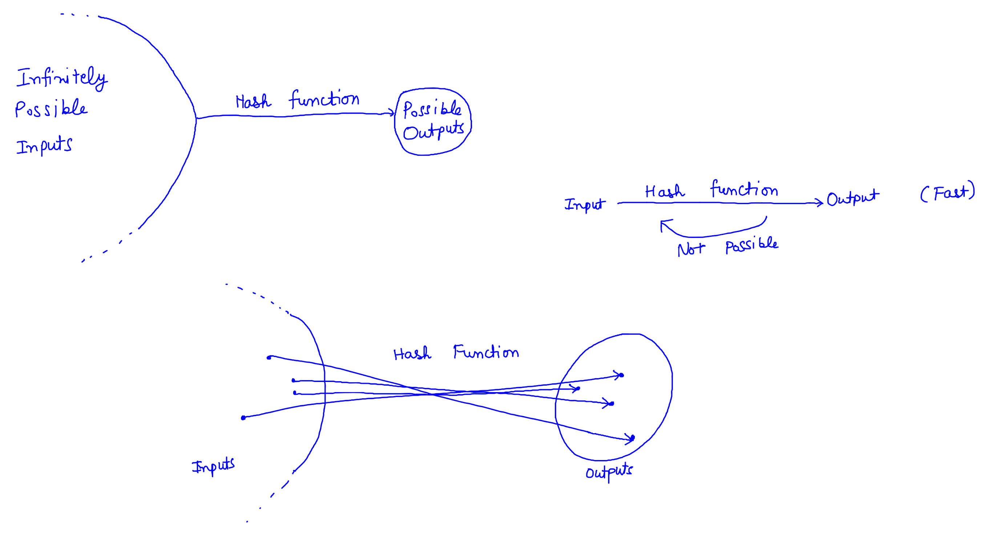

# Cryptographic hash functions
In previous chapter, we studied the structure of block header. Here is the summary of what we studied in the header:

| Byte Range | Header offset | Size (bytes) | Meaning | Is covered completely till now |
| :-: | :-: | :-: | :- | :-: |
| 8-11 | 0-3 | 4 | Version Number | Yes |
| 12-43 | 4-35 | 32 | Previous Block Hash  | No |
| 44-75 | 36-67 | 32 | Current Merkle Hash | No |
| 76-79 | 68-71 | 4 | Time | Yes |
| 80-83 | 72-75 | 4 | Difficulty | No |
| 84-87 | 76-79 | 4 | Nonce | No |

We need to study the meaning, usage and consequences of "Previous Block Hash" field and "Current Merkle Hash" field. But before answering them, we need to know what exactly is the meaning of "hash" here? What properties a cryptographic hash function should have, in order for it to be the core requirement of a financial system - Bitcoin. We will not go into the details of how these functions are calculated. We will not prove that specific hash functions posses the property of a cryptographic hash function. These details are best left for the mathematicians and security experts. We will state the general hash properties, try to understand their consequences and state the specific functions used in Bitcoin. In next chapter, we will directly go into the above two hash fields. We will discuss how they are used, how they fit in the big picture. We will answer one of the most important question of Blockchain: How to make sure that what is written in blockchain stays there forever. We will try to do some attacks on Blockchain and see how they are impractical and thus, understand why the system is stable enough to withstand any "technological" attacks for changes in storage.

Let's get started.

## Cryptographic Hash Functions
Let's understand what "hash" functions mean in the context of computer science. After that, we will jump right into cryptographic hash functions.

We can think that using a hash function generates the "signature" of a large (or small) file (or any input). What do we mean by signature? Before going into the actual details and jargon, let's take a problem and see how hash functions help us in this solution.

### Using hash functions in online education

You are a teacher. COVID pandemic hits the country and the institute switches to online mode of education. This is the time of exam, when students write their answers and upload their answers using email or other web service. There is a hard time limit after which their submission should not be considered. So, you set the deadline to end time of exam, plus additional $10$ minutes of time to upload their answers. But you are worried of one problem: students can use the extra time to write their answer instead of scanning their work. They can claim that their internet speed is slow, that's why there is a delay in uploading their answers. What can you do in this situation? You have no way to check if the problem is genuine or they are taking benefit of the situation. As a person of basic computer knowledge, can you do anything to separate the genuine students from others? 

Yes, there is a solution. Provide a hash function script to students, and tell them to either send their submission before deadline or send the hash of their file which they are supposed to submit using the provided script. This script basically calculates the hash or signature of their submission file. The output will be few bytes long, literally less than $1$ kilobyte. Once they send that hash, you can be sure that whatever file they upload in future, was actually scanned before the deadline!

This seems too good to be true. Assuming this type of hash function exist, what properties do you want from the signature? Here are few:

1. _The signature should be very small_, so that students can upload it in any network speed without any delay.
2. _Any change in the original file should result in different signatures_, otherwise the system will fail. This implies that we want to produce different signatures for different files.
3. _Students should be able to compute signature without consuming much time_, otherwise the deadline will be crossed.
4. _Any type of file should be supported_, otherwise students will put themselves in situation to create unsupported files by mistake. This imposes the condition that we should read each byte of the input, and the hash function should not assume anything about the structure of input data.
5. Anything you would like to add?

Cryptographic hash functions not only guarantee above properties, but they have few more beautiful properties that allow them to be used in modern computer securities, secure communication between two parties, etc. Next, we will see those properties in more structured manner.

### Properties of hash functions
Let's start with hash functions. These are the mathematical functions, having the following properties:

1. Input can be any length of string. Here, a string mean a sequence of bytes. This fulfills the requirement $4$ of online exam problem above.
2. Output (the signature) is of fixed size. Theoretically, this doesn't restrict the output to be small (a subjective term). In practice, the output is very small (from storage space perspective). For instance, `SHA-256` only generates $32$ bytes of output. This the the function which is used in Blockchain for hashing! But remember, being "small" is not the requirement of this definition. This fulfills the requirement $1$ of online exam problem.
3. The computation time should be fast/efficient. This means that our algorithm should be very fast, typically of the order of $O(n)$ where $n$ is the number of bytes of input.This fulfills the requirement $3$ of online exam problem.

The above definition of hash function is very generic, and it doesn't fulfill all the properties we want. For instance, the following function is a valid hash function: $$f(x)=0\text{, for all input $x$.}$$ Or, you can see the following pseudo code:

```{}
function calculate_hash(input):
  return 0
```

All it does is generates $0$ for any input. We can verify that this is a "valid" hash function in light of above properties. We need to be more creative. There is a branch of mathematics that is dedicated to study of cryptographic hash functions, and that is __cryptography__.

### Properties of cryptographic hash functions
As mentioned earlier, we will not go into the exact details but just state the additional properties that a cryptographic hash function should have, in addition to above mentioned $3$ properties:

4. Collision Resistance.
5. Irreversibility.
6. High Entropy: One small change for input, one giant leap in signature.

Here is the explanation of above three properties:

By collision resistance, we don't mean that for two different inputs, the output should be different. This is impossible for any hash function! On one side, we are allowing the input to be any size, and on another side, we are allowing output to be of fixed size. Here is the algorithm to find same signature for different inputs:

```{}
seen = collection of hashes seen thus far, initially empty.
i = 0

Do the following in repetition:
  x = hash of i
  increment i by 1
  check if x is in `seen`. If yes, we have a collision.
  If no, put x in `seen`
```

Will the above algorithm ever find a collision? Guaranteed! Why? The output size is fixed. Say, we can have $m$ distinct outputs. We compute hash for $m+1$ distinct integers. Logic says there will be some repetition.

So, what do we mean by collision resistance? We mean that for given hash function, it is _not practical_ to find two values $x$ and $y$ such that hash of both of them are same. And what do we mean by "not practical"? One way to think this is that number of possible outputs is so huge that we can't even go over every output. Meaning by, that above algorithm will take so much time, that is not possible to go over $m+1$ distinct values, no matter the speed of computers. Need some values? `SHA-256` algorithm generates an output of length $256$ bits. This mean that there are distinct $2^{256}$ values that this function can generate. But how large is this number? Age of universe is estimated to be $13.7$ billion years. Rounding up to $15$ billion years, we have $15\times 365 \times 24 \times 60 \times 60$ billion seconds. This is equivalent to $4.73\times {10}^{17}$ seconds. How much is $2^{256}$ in powers of $10$? Say $$10^x=2^{256}$$ which gives $$x=\frac{256 \times log{2}}{\log{10}}$$ which gives $$x \approx 77.064$$ Let's compare. Age of universe is about $4.73\times {10}^{17}$ seconds and `SHA-256` is able to generate $10^{77}$ distinct values! The scale of things is unimaginable. And compare this to the time in years we have computers with us. This is significantly small time. No matter the speed of computers, above algorithm can never be used!

Next, what do we mean by irreversibility? This means that given a signature, we can't infer anything about the input! We can understand the consequence of this property using an example. What if you make a prediction of something, write it, put it in an envelope, and put it on table for the world. You want to reveal the contents of envelope to the world after the time has passed, without anyone getting a hint of what you predicted. Then, you open the envelope in future and everyone will be amazed on the accuracy of your prediction. And the best part? You can prove this is exactly what you wrote in the past. You can be sure that your prediction is not leaked. World will be sure that you never changed the contents of envelope. Think about how this can be achieved using hash functions in practice.

Don't worry if you are unable to see the usefulness of above thought example. Remember this: irreversibility tell us that the function is "one-way" function. By input and hash function, you can calculate the output. But by output and hash function, you can't predict the input. Let's see an example of what this doesn't mean. Someone rolls a dice, and gives you the hash of the top number on dice after rolling. Can you predict the input? Think about it before going further.

The answer is yes. You can calculate the hash of each value from $1$ to $6$, and match that with the hash provided to you. Easy. Did the above property fail here? Again, think about it.

The answer is no. Above property says that given the _output_ and _hash function_, we can't predict anything about the input. Here, we had knowledge about the inputs! We knew exactly what are the possible input values and it was possible to simply go over every input. We used our knowledge of "6 possible outcomes of dice" to reverse the output of hash function. Let's change the game to something like this: Compute the hash of configuration of a chess board using a given hash. You are told about the final hash output and the hash function used. If the hash function has irreversibility property, you are doomed.

At last, we have the property of randomness. This doesn't mean that for fixed input, your output will be different. This means that if you make a small change in the input, even for one bit, the output hash will be "completely different" from the original hash. What do we exactly mean by "completely different"? This practically means that if you change anything in input of hash and you have the hash of original input, you can't predict what the hash of new input is. You best guess will be as good as a monkey typing on typewriter. This also means that if you generate hashes for any number of inputs/any type of inputs/any similar inputs/anything, you are unable to use that information to infer the hash of any new input you encounter. You can't even bet on a particular "bit" or "byte" of the hash of any new input better than a monkey placing a bet without any knowledge.

### Summary of cryptographic hash functions {#HashSummary}
You should be able to remember above $6$ properties. But for the general discussion, you can have the following mental model:

1. Hash functions takes anything as input, do some magic, and provide a fixed size output.
2. You can't predict anything about the output of this magic machine for any input, without actually computing the output using this magic machine.
3. The machine works very fast.
4. You can't predict the input from its hash.

Here are some diagrams for you to help remember above properties:
```{r echo=FALSE, out.width='100%', fig.align='center'}

```

## C++ Code
Bitcoin uses the `SHA256` hash function for hashing purposes. As the name implies, the output of this function is a $256$ bit number, or $32$ byte number. Modern hardware doesn't support $32$ byte numbers, so this raises a question. How does the code of Bitcoin handles this in `C++`? They have defined their own data type `uint256` in [uint256.h](https://github.com/bitcoin/bitcoin/blob/master/src/uint256.h) file. Do we need to implement our own data type? Not for now. We are not building the blockchain for now, we are just interpreting what is stored on disk. Also, we don't need to do arithmetic on those numbers. We just need to read and print them, or calculate them using a SHA256 implementation which handles this data type internally.

Coming to implementation, is there a built-in function to calculate `SHA-256` in `C++`? Sadly, no. We need to rely on external implementations of it. There are few good libraries we can use, for example, `OpenSSL` or `CryptoC++`. You can use them for free. We are going to take another approach. We are going to take the relevant portion for `SHA256` function from internet instead of downloading these libraries which have additional capabilities.

Create a new folder named SHA and add two files namely `SHA256.h` and `SHA256.cpp`. Also, add a file named as `LICENSE` in the same folder. The directory structure should look like this:

```{bash eval=FALSE}
.../bitcoin_reader
├── data
│   ├── 1k.dat
├── SHA
│   ├── LICENSE
│   ├── SHA256.cpp
│   ├── SHA256.h
├── main.cpp
```

### Obtaining the code for SHA-256 in `C++`
We are going to copy the implementation from this public Github Repo: [SHA256](https://github.com/System-Glitch/SHA256).

Now, you can copy and paste the following code in `SHA256.h`:
```{C++}
#ifndef SHA256_H
#define SHA256_H

#include <string>
#include <array>

class SHA256 {

public:
    SHA256();
    void update(const uint8_t * data, size_t length);
    void update(const std::string &data);
    uint8_t * digest();

    static std::string toString(const uint8_t * digest);

private:
    uint8_t  m_data[64];
    uint32_t m_blocklen;
    uint64_t m_bitlen;
    uint32_t m_state[8]; //A, B, C, D, E, F, G, H

    static constexpr std::array<uint32_t, 64> K = {
            0x428a2f98,0x71374491,0xb5c0fbcf,0xe9b5dba5,
            0x3956c25b,0x59f111f1,0x923f82a4,0xab1c5ed5,
            0xd807aa98,0x12835b01,0x243185be,0x550c7dc3,
            0x72be5d74,0x80deb1fe,0x9bdc06a7,0xc19bf174,
            0xe49b69c1,0xefbe4786,0x0fc19dc6,0x240ca1cc,
            0x2de92c6f,0x4a7484aa,0x5cb0a9dc,0x76f988da,
            0x983e5152,0xa831c66d,0xb00327c8,0xbf597fc7,
            0xc6e00bf3,0xd5a79147,0x06ca6351,0x14292967,
            0x27b70a85,0x2e1b2138,0x4d2c6dfc,0x53380d13,
            0x650a7354,0x766a0abb,0x81c2c92e,0x92722c85,
            0xa2bfe8a1,0xa81a664b,0xc24b8b70,0xc76c51a3,
            0xd192e819,0xd6990624,0xf40e3585,0x106aa070,
            0x19a4c116,0x1e376c08,0x2748774c,0x34b0bcb5,
            0x391c0cb3,0x4ed8aa4a,0x5b9cca4f,0x682e6ff3,
            0x748f82ee,0x78a5636f,0x84c87814,0x8cc70208,
            0x90befffa,0xa4506ceb,0xbef9a3f7,0xc67178f2
    };

    static uint32_t rotr(uint32_t x, uint32_t n);
    static uint32_t choose(uint32_t e, uint32_t f, uint32_t g);
    static uint32_t majority(uint32_t a, uint32_t b, uint32_t c);
    static uint32_t sig0(uint32_t x);
    static uint32_t sig1(uint32_t x);
    void transform();
    void pad();
    void revert(uint8_t * hash);
};

#endif
```

Also, copy and paste the following code in `SHA256.cpp` file:
```{C++}
#include "SHA256.h"
#include <cstring>
#include <sstream>
#include <iomanip>

SHA256::SHA256(): m_blocklen(0), m_bitlen(0) {
    m_state[0] = 0x6a09e667;
    m_state[1] = 0xbb67ae85;
    m_state[2] = 0x3c6ef372;
    m_state[3] = 0xa54ff53a;
    m_state[4] = 0x510e527f;
    m_state[5] = 0x9b05688c;
    m_state[6] = 0x1f83d9ab;
    m_state[7] = 0x5be0cd19;
}

void SHA256::update(const uint8_t * data, size_t length) {
    for (size_t i = 0 ; i < length ; i++) {
        m_data[m_blocklen++] = data[i];
        if (m_blocklen == 64) {
            transform();

            // End of the block
            m_bitlen += 512;
            m_blocklen = 0;
        }
    }
}

void SHA256::update(const std::string &data) {
    update(reinterpret_cast<const uint8_t*> (data.c_str()), data.size());
}

uint8_t * SHA256::digest() {
    uint8_t * hash = new uint8_t[32];

    pad();
    revert(hash);

    return hash;
}

uint32_t SHA256::rotr(uint32_t x, uint32_t n) {
    return (x >> n) | (x << (32 - n));
}

uint32_t SHA256::choose(uint32_t e, uint32_t f, uint32_t g) {
    return (e & f) ^ (~e & g);
}

uint32_t SHA256::majority(uint32_t a, uint32_t b, uint32_t c) {
    return (a & (b | c)) | (b & c);
}

uint32_t SHA256::sig0(uint32_t x) {
    return SHA256::rotr(x, 7) ^ SHA256::rotr(x, 18) ^ (x >> 3);
}

uint32_t SHA256::sig1(uint32_t x) {
    return SHA256::rotr(x, 17) ^ SHA256::rotr(x, 19) ^ (x >> 10);
}

void SHA256::transform() {
    uint32_t maj, xorA, ch, xorE, sum, newA, newE, m[64];
    uint32_t state[8];

    for (uint8_t i = 0, j = 0; i < 16; i++, j += 4) { // Split data in 32 bit blocks for the 16 first words
        m[i] = (m_data[j] << 24) | (m_data[j + 1] << 16) | (m_data[j + 2] << 8) | (m_data[j + 3]);
    }

    for (uint8_t k = 16 ; k < 64; k++) { // Remaining 48 blocks
        m[k] = SHA256::sig1(m[k - 2]) + m[k - 7] + SHA256::sig0(m[k - 15]) + m[k - 16];
    }

    for(uint8_t i = 0 ; i < 8 ; i++) {
        state[i] = m_state[i];
    }

    for (uint8_t i = 0; i < 64; i++) {
        maj   = SHA256::majority(state[0], state[1], state[2]);
        xorA  = SHA256::rotr(state[0], 2) ^ SHA256::rotr(state[0], 13) ^ SHA256::rotr(state[0], 22);

        ch = choose(state[4], state[5], state[6]);

        xorE  = SHA256::rotr(state[4], 6) ^ SHA256::rotr(state[4], 11) ^ SHA256::rotr(state[4], 25);

        sum  = m[i] + K[i] + state[7] + ch + xorE;
        newA = xorA + maj + sum;
        newE = state[3] + sum;

        state[7] = state[6];
        state[6] = state[5];
        state[5] = state[4];
        state[4] = newE;
        state[3] = state[2];
        state[2] = state[1];
        state[1] = state[0];
        state[0] = newA;
    }

    for(uint8_t i = 0 ; i < 8 ; i++) {
        m_state[i] += state[i];
    }
}

void SHA256::pad() {

    uint64_t i = m_blocklen;
    uint8_t end = m_blocklen < 56 ? 56 : 64;

    m_data[i++] = 0x80; // Append a bit 1
    while (i < end) {
        m_data[i++] = 0x00; // Pad with zeros
    }

    if(m_blocklen >= 56) {
        transform();
        memset(m_data, 0, 56);
    }

    // Append to the padding the total message's length in bits and transform.
    m_bitlen += m_blocklen * 8;
    m_data[63] = m_bitlen;
    m_data[62] = m_bitlen >> 8;
    m_data[61] = m_bitlen >> 16;
    m_data[60] = m_bitlen >> 24;
    m_data[59] = m_bitlen >> 32;
    m_data[58] = m_bitlen >> 40;
    m_data[57] = m_bitlen >> 48;
    m_data[56] = m_bitlen >> 56;
    transform();
}

void SHA256::revert(uint8_t * hash) {
    // SHA uses big endian byte ordering
    // Revert all bytes
    for (uint8_t i = 0 ; i < 4 ; i++) {
        for(uint8_t j = 0 ; j < 8 ; j++) {
            hash[i + (j * 4)] = (m_state[j] >> (24 - i * 8)) & 0x000000ff;
        }
    }
}

std::string SHA256::toString(const uint8_t * digest) {
    std::stringstream s;
    s << std::setfill('0') << std::hex;

    for(uint8_t i = 0 ; i < 32 ; i++) {
        s << std::setw(2) << (unsigned int) digest[i];
    }

    return s.str();
}
```

Addition to above two files, add the following copyright notice to `LICENSE` file. This notice is taken from the repo containing `SHA256` code, so it is necessary to add the proper `LICENSE` with the code.
```{}
MIT License

Copyright (c) 2021 Jérémy LAMBERT (SystemGlitch)

Permission is hereby granted, free of charge, to any person obtaining a copy
of this software and associated documentation files (the "Software"), to deal
in the Software without restriction, including without limitation the rights
to use, copy, modify, merge, publish, distribute, sublicense, and/or sell
copies of the Software, and to permit persons to whom the Software is
furnished to do so, subject to the following conditions:

The above copyright notice and this permission notice shall be included in all
copies or substantial portions of the Software.

THE SOFTWARE IS PROVIDED "AS IS", WITHOUT WARRANTY OF ANY KIND, EXPRESS OR
IMPLIED, INCLUDING BUT NOT LIMITED TO THE WARRANTIES OF MERCHANTABILITY,
FITNESS FOR A PARTICULAR PURPOSE AND NONINFRINGEMENT. IN NO EVENT SHALL THE
AUTHORS OR COPYRIGHT HOLDERS BE LIABLE FOR ANY CLAIM, DAMAGES OR OTHER
LIABILITY, WHETHER IN AN ACTION OF CONTRACT, TORT OR OTHERWISE, ARISING FROM,
OUT OF OR IN CONNECTION WITH THE SOFTWARE OR THE USE OR OTHER DEALINGS IN THE
SOFTWARE.
```

### Calculating SHA-256
As you already know, we are going to use `SHA-256` as a black box. Before going into complete code, it is necessary to get the idea of rules we need to follow to calculate the hash. We will use the following code to calculate the SHA-256:
```{C++}
// `start` is the starting address of our byte data and `len` is the number of bytes we need to read.
int len = ...; 
uint8_t* start = ...;

// Create an instance of SHA256 class
SHA256 sha1;

// Pass the byte array to update method.
sha1.update(start, len);

// Get the byte array of length 32 bytes which contain our hash, allocated in heap
uint8_t * digest = sha1.digest();

// After using the hash output, we need to deallocate it so that there is no memory leak.
delete[] digest;
```

To print, we will just iterate over it and print the HEX of individual bytes:
```{C++}
std::cout << "Hash: ";
for (int i = 0; i < 32; ++i)
    std::cout << HEX(digest[i], 1);
std::cout << std::endl;
```

If you have a `std::string` with you, you can directly pass it to `update` method. You might think that `std::string` is null-terminated, so that will create problems. This is not the case at all. You can check that the string is casted as byte array in `SHA256` and the `size()` function is used to get the length, so '\0' is ignored in computations. Create a file named `demo.cpp` to test above `SHA256` code in the same folder as `main.cpp`. Write the file contents as:
```{C++}
#include <iostream>
#include <iomanip>
#include <string>
#include <unistd.h>
#include "SHA/SHA256.h"
#define HEX( x, len ) std::setw(2 * len) << std::setfill('0') << std::hex << std::uppercase << (((1ll << (8 * len)) - 1) & (unsigned int)( x )) << std::dec

// calculates hash of byte sequence
void calculate_hash(uint8_t* start, int len)
{
    // Calculate hash
    SHA256 sha1;
    sha1.update(start, len);
    uint8_t * digest = sha1.digest();

    // Print hash
    std::cout << "Hash: ";
    for (int i = 0; i < 32; ++i)
        std::cout << HEX(digest[i], 1);
    std::cout << std::endl;

    // Deallocate dest
    delete[] digest;
}


// calculates hash of byte sequence
void calculate_hash(std::string &str)
{
    // Calculate hash
    SHA256 sha1;
    sha1.update(str);
    uint8_t * digest = sha1.digest();

    // Print hash
    std::cout << "Hash: ";
    for (int i = 0; i < 32; ++i)
        std::cout << HEX(digest[i], 1);
    std::cout << std::endl;

    // Deallocate digest
    delete[] digest;
}

int main()
{
    std::uint8_t arr1[3] = {'a', 'b', 'c'};
    calculate_hash(arr1, 3);

    std::uint8_t  arr2[4] = {'a', 'b', 'c', '\0'};
    calculate_hash(arr2, 4);

    std::string str = "abc";
    calculate_hash(str);
}
```

Compile the above code using the following command:
```{bash eval=FALSE}
g++ demo.cpp SHA/SHA256.cpp -o demo.out -std=c++17
```

Run using this command:
```{bash eval=FALSE}
./demo.out 
```

The output will be:
```{bash eval=FALSE}
Hash: BA7816BF8F01CFEA414140DE5DAE2223B00361A396177A9CB410FF61F20015AD
Hash: DC1114CD074914BD872CC1F9A23EC910EA2203BC79779AB2E17DA25782A624FC
Hash: BA7816BF8F01CFEA414140DE5DAE2223B00361A396177A9CB410FF61F20015AD
```

We can see that `'\0'` is not included in calculation of `SHA-256` hash by checking that first and third hash are equal. You can also see that inclusion of ''\0'` completely changes the hash output!

Now, delete both `demo.cpp` and `demo.out` files as they are not required anymore.

### Considerations inside Bitcoin
#### Double hashing
There are two things that we need to keep in mind while working with `SHA256` in Bitcoin. First, we calculate the double `SHA256` of data, instead of single `SHA256` used above. Why do they do this? There is no clear consensus in community what benefits it provide. You are requested to do your own research on internet, read the arguments of people and come up with your own conclusions. We are not going into why they use it, we just accept it as the mathematics is beyond our comprehension. So, how should we calculate the double hash? Here are the steps for the same:

```{C++}
// Calculate hash
SHA256 sha1;
sha1.update(start, len);
uint8_t * digest = sha1.digest();

// Double hash
SHA256 sha2;
sha2.update(digest, 32);
auto digest2 = sha2.digest();

// Remove old digest, as it is not required anymore
delete[] digest;

// Use digest2 as hash, and then free the memory
delete[] digest2;
```

We need to make sure to delete the memory after usage, otherwise there will be memory leak.

#### Little endian causing problems
The `SHA256` algorithm is endian agnostic. This means that we don't know if the output of it is in big-endian format or little-endian format, as it is irrelevant to the working of algorithm. So, where is the problem?

As we already mentioned, Bitcoin implements `uint256` datatype. As with all integers, they store everything as little endian. So it was by design that Bitcoin developers store `uint256` in little endian format too. If we cast the results of above `SHA` algorithm to `uint256` and print the hex value, we should flip the bytes! This is the reason we print `previous hash` and `Merkle hash` in reverse order of bytes in previous chapter. Keep a note of this, otherwise you will be confused in future when we will talk about changing `nonce` to generate block hash.

## Summary
In this chapter, we studied about cryptographic hash functions. We saw all the $6$ properties of hash functions and saw what features they provide us. After that, we saw a `C++` code which computes `SHA-256` for us and looked at its interface. We didn't go into the actual implementation details of `SHA-256` because that comes under cryptography and the level of mathematics required to understand `SHA` is not helpful in Bitcoin. At last, we saw that Bitcoin protocol uses double hash `SHA-256` and little endian introduces a problem which we will see in future. In coming chapters, we apply the properties studied in this chapter to see how the blockchain provides us the feature of permanent storage.
